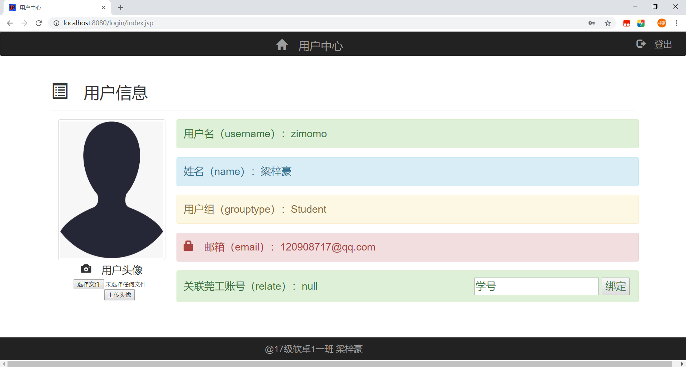
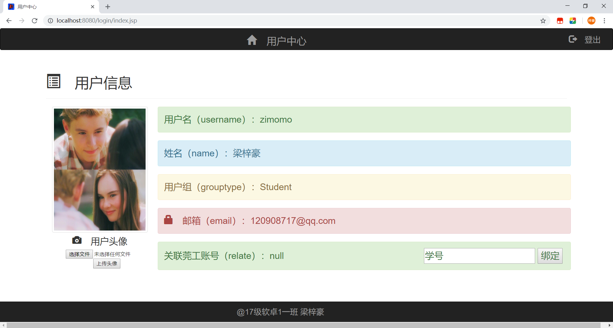
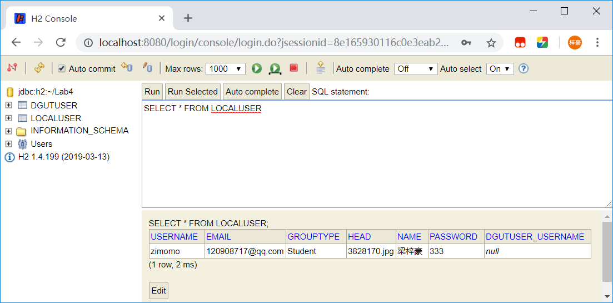
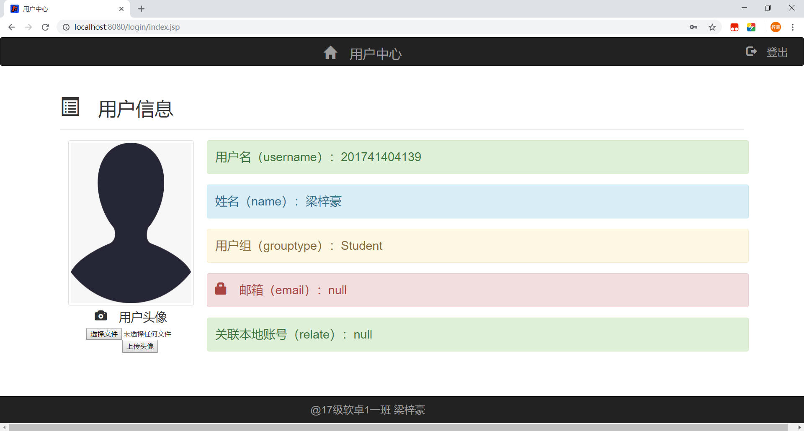
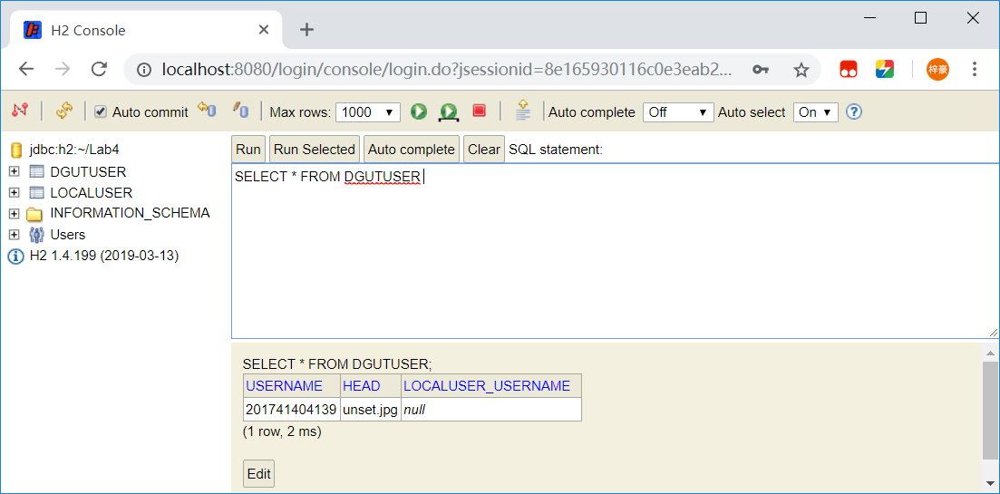
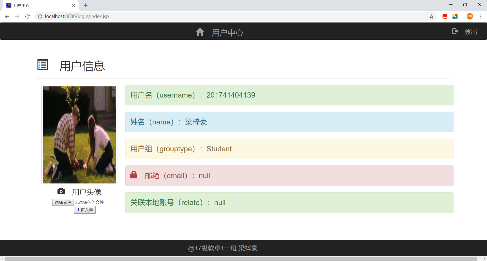
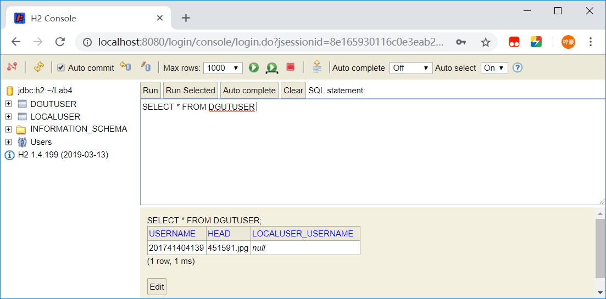
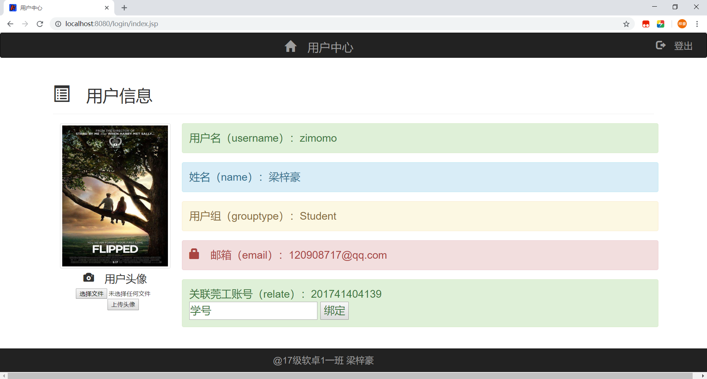
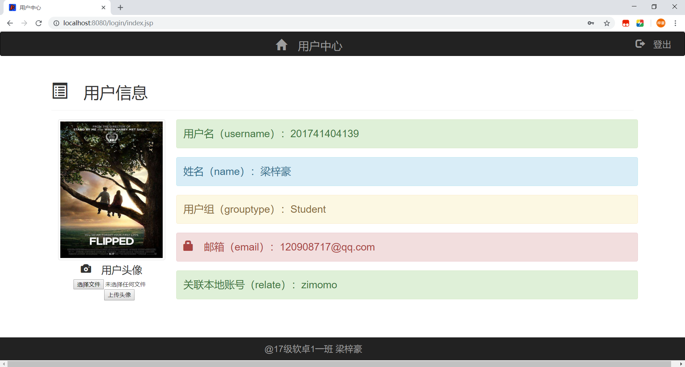

# 《JAVA EE企业级架构》课程实验报告
|||
|:---|:---|
|院（系）名称：|网络空间安全学院|
|专业班级：|17软件工程卓越计划1班|
|学号：|201741404139|
|姓名：|梁梓豪|
|实验题目：|实验4 JDBC|
|实验日期：|2019/5/7|
|实验（上机）学时：|2|
|成绩：||

一、实验内容、要求  

改写用户注册/登录模块，使用JDBC或JPA技术实现用户数据的持久化，大致功能如下：

1. 设计用户实体Entity与莞工登录用户Entity，并设置关联。

2.	Entity需要校验用户数据的合法性。

3.	用户照片保存在数据库中；前端显示用户照片时，改为读取数据库。

4.	任何数据库操作发生错误时，请导向error.jsp，并回滚数据库事务。

5.	增加绑定莞工中央认证账号的功能。本地账号登录的用户，可以在用户中心绑定莞工认证账号。绑定后，本地账号与莞工中央认证账号关联（一对一），并且使用莞工中央认证登录等价于本地账号登录。

二、所采用的Java EE技术规范

1. JSP

2. Servlet

3. JavaBean

4. JDBC

5. JPA

三、实验的主要模块及其功能

（一）Entity关系设计

@OneToOne　一对一双向对应关系

莞工登陆用户Entity

|参数名|参数说明|
|:---:|:---|
|username|用户名|
|head|头像文件名|
|localuser_username|关联本地用户外键|

本地登陆用户Entity

|函数名|函数说明|
|:---:|:---|
|username|用户名|
|email|邮箱|
|grouptype|用户组|
|head|头像文件名|
|name|姓名|
|password|密码|
|dgutuser_username|关联莞工用户外键|

（二）校验用户数据的合法性

（1）注册验证

1. register.jsp提交注册信息表单

2. register_action.jsp接收注册信息，并进行如下逻辑业务处理：  

    ① 可用以下jsp语句把接收的注册信息快速赋值存储到UserBean中
    ```
    <jsp:useBean id="userBean" scope="request" class="Bean.UserBean" >
        <jsp:setProperty name="userBean" property="*" />
    </jsp:useBean>
    ```
    ② 注册逻辑业务login_action.jsp伪代码如下：
    ```
    if(注册信息为空){
        提示注册信息为空，跳转到注册页面register.jsp重新填写;
    }
    else if(两次输入的密码不一致){
        提示两次输入的密码不一致，跳转到注册页面register.jsp重新填写;
    }
    if(用户名未被注册){
        用注册信息新建本地用户对象，并持久化;
        跳转到登陆页面login.html;
    }else{
        提示该用户名已被注册，跳转到注册页面register.jsp重新填写;
    }
    ```

3. 关键函数说明：

    ① 检验用户名是否已被注册
    
    调用EntityManager的find函数，查找是否存在该用户名的本地用户对象
    
    函数check_register()代码如下：
    ```
    public boolean check_register(){
        boolean isValid = false;
        localUser= em.find(LocalUser.class,username);
        if(localUser!=null)
            isValid=true;
        return isValid;
    }
    ```
    ② 新建本地用户对象，并持久化
 
    函数add()代码如下：
    
    ```
    public void add(){
        localUser=new LocalUser(username,password1,email,name,grouptype,head);
        tx.begin();
        em.persist(localUser);
        tx.commit();
    }
    ```

（2）登陆验证

1. login.html提交登陆信息表单

2. login_action.jsp接收注册信息，并进行如下逻辑业务处理：  

    login_action.jsp伪代码如下：
    ```
    if(登陆信息为空){
        提示登陆信息为空，跳转到登陆页面login.html重新填写;
    }
    if(用户名和密码正确){
        把从数据库中找到的对象用户信息存入session;
        跳转到主页index.jsp
    }else{
        提示用户名或密码错误，跳转到登陆页面login.html重新填写;
    }
    ```

3. 关键函数说明：

    ① 验证登陆
    
    调用EntityManager的find函数，查找是否存在该用户名的本地用户对象，有则验证密码是否正确
    
    函数check_login()代码如下：
    ```
    public boolean check_login(){
        boolean isValid = false;
        localUser= em.find(LocalUser.class,username);
        if(localUser!=null)
            if(localUser.getpassword().equals(password1)) {
                password1=localUser.getpassword();
                email=localUser.getemail();
                name=localUser.getname();
                grouptype=localUser.getgrouptype();
                head=localUser.gethead();
                isValid = true;
            }
        return isValid;
    }
    ```

（三）头像上传功能

1. 用户中心首页提供头像上传按钮，提交文件表单到Upload_Servlet处理

2. Upload_Servlet伪代码如下：

    ```
    从session中读取用户名和头像文件名
    
    if(用户头像文件不为unset.jpg){
        根据该用户头像文件名head删除原头像文件;
    }
    
    接收文件
    
    产生一个整型随机数作为新头像文件名，保存头像
    
    更新数据库中该用户及其关联用户的头像文件名（在第3点说明）
    
    跳转到用户中心首页index.jsp
    ```

3. 更新用户及其关联用户的头像文件名

    伪代码如下：
    ```
    if(该用户是本地用户){
        更新本地用户头像名
        if(有关联莞工用户){
            更新关联的莞工用户头像名
        }
    }
    else{
        更新莞工用户头像名
        if(有关联本地用户){
            更新关联的本地用户头像名
        }
    }
    ```
    
    Upload_Servlet代码：
    ```
    localUser1=em.find(LocalUser.class,username);
        if(localUser1!=null){
            localUser1.sethead(head);
            tx.begin();
            em.persist(localUser1);
            tx.commit();
            if(localUser1.getdgutUser()!=null) {
                dgutUser1=localUser1.getdgutUser();
                dgutUser1.sethead(head);
                tx.begin();
                em.persist(dgutUser1);
                tx.commit();
            }
        }
        else{
            dgutUser1=em.find(DgutUser.class,username);
            dgutUser1.sethead(head);
            tx.begin();
            em.persist(dgutUser1);
            tx.commit();
            if(dgutUser1.getlocalUser()!=null) {
                LocalUser localUser_temp=dgutUser1.getlocalUser();
                localUser_temp.sethead(head);
                tx.begin();
                em.persist(localUser_temp);
                tx.commit();
            }
        }
    ```
    
（四）绑定莞工账号

首页index根据session判断是本地登录用户还是莞工登陆用户

若是本地登陆用户，则首页提供绑定莞工账号表单，提交到Relate_Servlet处理

Relate_Servlet业务逻辑伪代码如下：
```
根据表单提交的莞工账号，查找是否存在对应的莞工用户对象

if(存在对应的莞工用户对象)
{
    把莞工用户对象和本地用户对象相互赋值，并持久化
    把关联用户名写入session，跳转回index.jsp首页
}
else
    跳转回index.jsp首页
```
Relate_Servlet代码如下：
```
    LocalUser localUser=em.find(LocalUser.class,username);
    DgutUser dgutUser=em.find(DgutUser.class,relate);
    if(dgutUser!=null) {
        localUser.setdgutUser(dgutUser);
        dgutUser.setlocalUser(localUser);

        tx.begin();
        em.persist(localUser);
        em.persist(dgutUser);
        tx.commit();

        session.setAttribute("relate", relate);
        response.sendRedirect("index.jsp");
    }
    else {
        response.sendRedirect("index.jsp?error=yes");
    }
```

四、程序运行时的输入数据/输出结果  

（一）本地用户登陆




（二）本地用户修改头像





（三）莞工登陆





（四）莞工登陆修改头像





（五）绑定莞工用户并修改头像






